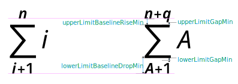
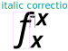
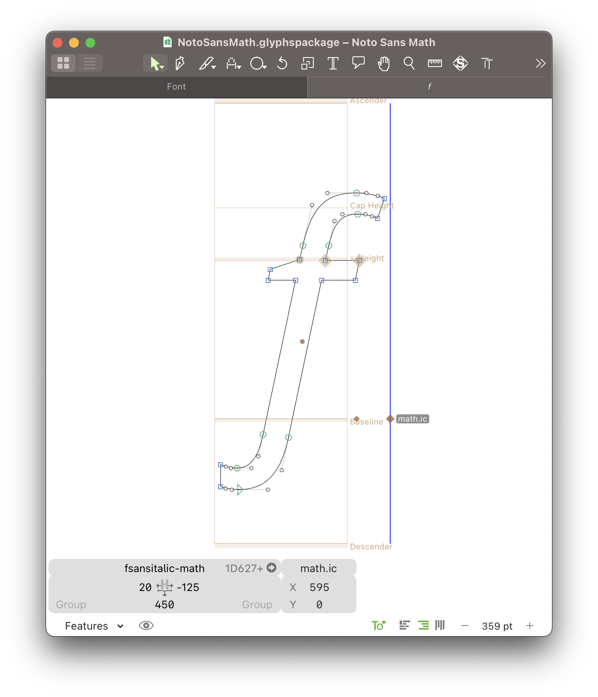
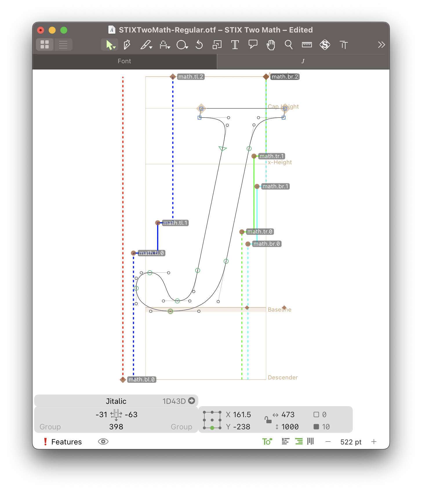
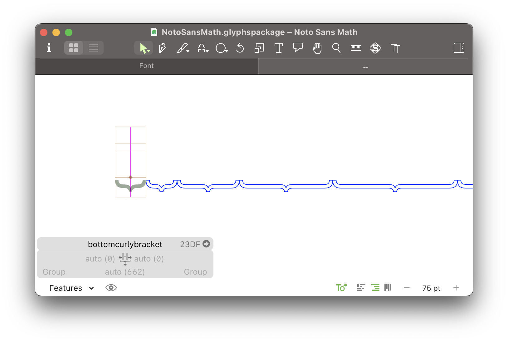

# Building OpenType math fonts
Math typesetting is different to regular text typesetting, for two main reasons: first, because math formulas are arranged in two dimensions, and second, because there is an interaction between symbols of different styles and sizes. Because of this, math fonts have always been a special kind of fonts. One of the most famous, if not the most famous, math typesetting engines is TeX, and its mathematical typesetting requires a complex setup involving a variety of fonts (for upright, italic, regular, bold, symbols, etc),  special metrics, and font parameters. TeX predates both TrueType and OpenType. When OpenType started supporting math typesetting, it built on the experience gained on TeX, but upgraded to support the newer technologies of Unicode and OpenType.

In OpenType math typesetting, instead of multiple fonts, all symbols are contained in a single font; the various “font styles” use dedicated Unicode math alphanumerics codepoints; and all the additional glyphs required (for example, superscripts and subscripts and variant sized versions of glyphs) are included in the same font. OpenType also introduced a new `MATH` table that stores various special parameters for typesetting math (*math constants*) and math-specific metrics, as well as a few registered feature tags to enable math-specific glyph substitutions. We will discuss more about both of these aspects below.

## Understanding math layout
Probably the the most detailed resource about math layout is Knuth’s *The TeXbook*, and particularly its “Appendix G: Generating Boxes from Formulas”. Appendix G is a heavy text that can be hard to follow at times without visual aide, so Bogusław Jackowski wrote [Appendix G Illuminated](https://tug.org/TUGboat/tb27-1/tb86jackowski.pdf) which provides a collection of illustrations to accompany Appendix G.

Appendix G documents algorithms using TeX fonts and metrics, which is very close to OpenType `MATH` table, but does not always map to it one-to-one, so Ulrik Vieth wrote [OpenType Math Illuminated](https://www.tug.org/~vieth/papers/bachotex2009/ot-math-paper.pdf), which illustrates the similarities and differences
between TeX math fonts and OpenType math fonts.

The OpenType spec documents the [`MATH` table](https://learn.microsoft.com/en-us/typography/opentype/spec/math), but the documentation mostly focusses on the data structure; it is light on the details of the algorithms involved in math layout and assumes prior familiarity with TeX math layout model, but it sometimes goes into details when discussing novel concepts which do not exist in TeX.

There is also the [MathML Core](https://www.w3.org/TR/mathml-core/) specification, which discusses math layout using MathML and OpenType math fonts. This is still a working draft (at the time of writing) and documents only a subset of math layout; it also uses a language that is probably only more penetrable to people familiar with W3C specifications.

## Character set
Math fonts require a large number of glyphs; the number can range from about 1000 to 6000 glyphs, depending on what character set is supported by the font. There is no single, well-defined character set for math fonts. Unicode includes thousands of math related characters, so each project defines its own character set based on its own requirements.

The [symbols defined](https://texdoc.org/serve/unimath-symbols.pdf/0) by the `unicode-math` LaTeX package is a good resource, and the subset of these symbols that are defined by Plain TeX, LaTeX, and `amssymb` (indicated in the document) should be a good start for new math fonts.

Here are some of the Unicode blocks related to mathematics:

### Alphanumerics
* Basic Latin (ASCII), [U+0000–007F](https://unicode.org/charts/PDF/U0000.pdf): This includes the upright regular basic Latin character as well as upright digits. It also includes some basic operators and punctuation used in math (e.g. plus and brackets).
* Greek, [U+0370–03FF](https://unicode.org/charts/PDF/U0370.pdf): This includes upright regular Greek characters. The accented, archaic, and Coptic-derived characters are not usually used in math, so can be skipped. However, the variant letter forms, such as Greek Phi Symbol (U+03D5), are often used in math and so should be included.
* Mathematical Alphanumeric Symbols, [U+1D400–1D7FF](https://unicode.org/charts/PDF/U1D400.pdf): This is a quite large block (around 1000 characters), as it includes the following styles:
  * Latin
    * upright bold
    * italic regular
    * italic bold
    * script regular
    * script bold
    * fraktur regular
    * fraktur bold
    * double-struck regular
    * double-struck bold
    * sans-serif upright regular
    * sans-serif upright bold
    * sans-serif italic regular
    * sans-serif italic bold
    * monospace upright regular
  * Greek
    * upright bold
    * italic regular
    * italic bold
    * sans-serif upright bold
    * sans-serif italic bold
  * Digits:
    * bold
    * double-struck regular
    * sans-serif regular
    * sans-serif bold
    * monospace regular
    
  Some of the styles in this block are missing a few characters, because they were already defined in Unicode in a different block.
* Letterlike Symbols, [U+2100–214F](https://unicode.org/charts/PDF/U2100.pdf): This includes some symbols which can be used in math, and specially some alphanumeric symbols missing from the previous block. For example, U+210E is used for Latin italic h, which is not included with the other Latin italic letters in the above block.
* Arabic, [U+0600–06FF](https://unicode.org/charts/PDF/U0600.pdf): For Arabic math support, the Arabic-Indic and Extended Arabic-Indic digits need to be included, as well as the  basic Arabic letters. These letters only need to be included in isolated form only.
* Arabic Mathematical Alphabetic Symbols, [U+1EE00–1EEFF](https://unicode.org/charts/PDF/U1EE00.pdf): This includes Arabic math letters, in isolated, initial, extended, tailed, looped, and double-struck forms. The design of isolated forms for math symbols sometimes differs from the basic isolated forms, so both should be included in fonts intended to support Arabic math.

### Symbols
* Latin-1 Supplement, [U+0080–00FF](https://unicode.org/charts/PDF/U0080.pdf): Includes some operators like multiplication and division.
* Mathematical Operators, [U+2200–22FF](https://unicode.org/charts/PDF/U2200.pdf): Includes a large set of most commonly used math operators.
* Supplemental Mathematical Operators, [U+2A00–2AFF](https://unicode.org/charts/PDF/U2A00.pdf): More commonly used operators.
* Miscellaneous Mathematical Symbols-A, [U+27C0–27EF](https://unicode.org/charts/PDF/U27C0.pdf)
* Miscellaneous Mathematical Symbols-B, [U+2980–29FF](https://unicode.org/charts/PDF/U2980.pdf)
* Miscellaneous Technical, [U+2300–23FF](https://unicode.org/charts/PDF/U2300.pdf): Includes some common math symbols, plus a few legacy ones (like U+23B2 Summation Top).
* General Punctuation, [U+2000–206F](https://unicode.org/charts/PDF/U2000.pdf): Invisible operators and some other symbols.
* Arrows, [U+2190–21FF](https://unicode.org/charts/PDF/U2190.pdf)
* ...

## OpenType features
Math fonts use several OpenType features for proper math layout. Although none of these features are strictly required for a working math font, they are crucial if one is aiming to support fine mathematical typography.

### Math script style alternates ([`ssty`](https://learn.microsoft.com/en-us/typography/opentype/spec/features_pt#ssty))
Math often includes glyphs at smaller point sizes, used for situations such as superscripts, subscripts, fraction numerators, and denominators. For proper typography, these glyphs need to be optically adjusted to fit the smaller point sizes. Compare the rendering of superscripts with optical adjusted glyphs (left) and without optical adjustments (right):


In OpenType math, this is handled by including two additional sets of glyphs, designed for the first- and second-level script forms (e.g. subscript and subsubscript). Third or higher levels of alternates will use the second-level set. The glyphs should be designed at full size and not moved vertically (unlike glyphs used in the `sups` and `subs` features), since the scaling and positioning will be done by the math layout engine (the scaling percent is controlled by two font constants, [discussed below](#scriptpercentscaledown-scriptscriptpercentscaledown)).

These alternate glyphs are applied using the `ssty` feature, using a multiple alternate substitution lookup, e.g.:
```fea
sub a from [a.ssty1 a.ssty2];
sub b from [b.ssty1 b.ssty2];
```

If only one alternate is provided, it is possible to provide a single substitution, i.e.:
```fea
sub a by a.ssty1;
sub b by b.ssty1;
```

However, some math layout engines might revert back to the base glyph for second level scripts when a single substitution is used. Because of this, it is preferable to always use multiple alternates with two alternates even if there is actually one alternate glyph (i.e. by repeating the first glyph):

```fea
sub a from [a.ssty a.ssty];
sub b from [b.ssty b.ssty];
```

#### Primes
Prime characters are an interesting case for `ssty` feature. In most fonts, the primes are designed as raised apostrophe-like glyphs, but in TeX, prime was designed as a full sized glyph that sets near the baseline. The math input treats it as a superscript that then gets scaled and moved vertically like any other superscript. OpenType math inherits this, so if the font includes a prime glyph which is designed in the usual way to suit text fonts (smaller and above the baseline), the layout engine will further scale it down and raise it up, making it look smaller and higher than expected. Compare the expected size and position of the primes (left) with when text primes are used in math layout without any changes (right):


There are two ways to fix this:
1. Design the prime glyph full-size and aligned with the baseline, as TeX fonts do; in this case, when prime is used outside the math engine, it will look wrong.
2. Design the base prime glyph as normal, and provide an alternate glyph that is designed like TeX fonts to be activated with the `ssty` feature. This way prime looks correct when used in both text and math modes.

This should apply to all the prime characters in Unicode: U+2032, U+2033, U+2034, U+2035, U+2036, U+2037, and U+2057.

### Flattened ascent forms ([`flac`](https://learn.microsoft.com/en-us/typography/opentype/spec/features_fj#flac))
Sometimes, accents over capitals are reduced in height to reduce the overall height of the accented glyphs. In OpenType math, precomposed accented glyphs (e.g. `aacute`) are not used. Accents are placed by the math layout engine, controlled by several constants which we will discuss later. The `flac` feature allows for providing an alternate set of accents to be used over capital glyphs (in fact, over *any* glyphs taller than [a constant](#flattenedaccentbaseheight) defined by the font). It should use a single substitution lookup:

```fea
sub acutecomb by acutecomb.flac;
```

### Dotless forms ([`dtls`](https://learn.microsoft.com/en-us/typography/opentype/spec/features_ae#dtls))
Sometimes “i” and “j” glyphs lose their dot (tittle) when an accent is placed over them:


This feature is used to substitute them with dotless alternate glyphs, and it should apply to all “i” and “j” glyphs (upright, italic, bold, script, fraktur, and so on). It should use a single substitution lookup:
```fea
sub i by idotless;
sub iitalic-math by iitalic-math.dotless;
```

## The `MATH` table
OpenType math fonts have a dedicated table that contains data related to math typesetting. This include various font wide math typesetting parameters, as well as glyph-level math-related metrics and data. OpenType math layout engines consult this table when building up math equations.

Some aspects of this table might seem redundant. For example, it provides ways of positioning accents over base glyphs. In text fonts, this is usually done with OpenType Layout rules in the `GPOS` table. However, math accent positioning can involve more complex cases than can be handled by `GPOS` table, such as accents over multiple letters:


Because of this *the `GPOS` table is not used in math layout and the `MATH` table is used instead*. Some math engine implementations *might* apply `GPOS` kerning, but most engines do not. `GPOS` layout should not be relied upon in a mathematical environment.

[“Mathematical Typesetting”](https://learn.microsoft.com/en-us/typography/cleartype/pdfs/cambriamath.pdf), a booklet by Ross Mills and John Hudson, is a nice overview of the `MATH` table and its capabilities, and math typesetting in general.

Editing the `MATH` table can be cumbersome since few tools support it. Currently the tools available for editing the `MATH` table are FontForge, the [Glyphs MATH Plugin](https://github.com/Nagwa-Limited-Community/Glyphs-MATH-Plugin), and custom scripts using the FontTools Python Library. (There was also a tool from Microsoft, but it does not seem to be publicly available anymore.)

The general idea is the same, so the examples here will use Glyphs with the MATH plugin and FontForge, but it should be applicable to any other tool with the necessary modifications.

The `MATH` table can roughly be divided into font-wide parameters (constants) and glyph-level data.

### Constants
Constants are font-wide data that control various aspects of math typesetting.

For many of these constants, a value relative to something called the _default rule thickness_ is suggested. This is a vestige from TeX where these constants didn’t have dedicated font parameters and TeX used hard-coded values relative to a font parameter called _default rule thickness_ that was used for fraction bar, overline, radical bar, and so on. The `MATH` table does not, however, have a single rule thickness because each of these uses has its own dedicated constant - though in practice, these constants are often set to the same value. So when you see _default rule thickness_ mentioned, it should be the value of one of the rule thickness constants like [`fractionRuleThickness`](#fractionrulethickness), [`overbarRuleThickness`](#overbarverticalgap-overbarrulethickness-overbarextraascender), or [`radicalRuleThickness`](#radicalrulethickness).

In Glyphs, these constants can be edited from _Edit → Edit MATH Constants_:


Next to each constant there is a _guess_ button, which tries to apply some of the suggestions below. Since many of the guessed constants depend on the rule thickness, the rule thickness constants should be guessed/set first.

In FontForge they can be edited from _Element → Other Info → MATH Info_:


#### `scriptPercentScaleDown`, `scriptScriptPercentScaleDown`
This is the percent by which first- and second-level superscripts and subscripts will be scaled. The spec recommends 80% for `scriptPercentScaleDown` and 60% for `scriptScriptPercentScaleDown`. However, this is too big when optically sized alternates are provided (the `ssty` feature); a better value is probably between 60-70% for `scriptPercentScaleDown` and around 50% for `scriptScriptPercentScaleDown`.

For comparison, TeX’s default setup uses 10pt for base font size, and 7pt for first level scripts, and 5pt for the second level (TeX’s default fonts are optically adjusted to the point size they are used for). This constant should be taken into account when designing the [`ssty`](#math-script-style-alternates-ssty) variants, i.e. 70% means you are designing for 7pt optical size, and so on.

#### `delimitedSubFormulaMinHeight`
Nobody knows what this constant is for, except that Microsoft’s math layout engine [mistakenly uses it instead of the next constant](https://github.com/MicrosoftDocs/typography-issues/issues/1136), so in reality it needs to be set to whatever value `displayOperatorMinHeight` is set to.

#### `displayOperatorMinHeight`
Math layout engines use a [bigger glyph](#size-variants) for _big_ operators (e.g. integral or summation) when math equations are in *display mode*.

> *Display mode* refers to math which is placed standalone between paragraphs, as opposed of being inline with the regular text.
> Compare *inline* $\sum a \prod b \int c$ with *display*:

> $$\sum a \prod b \int c$$

This means that at least two glyphs are needed for each big operator: one for text math and the other for display math. It is possible to have more than one glyph, and this constant tells the layout engine what is the minimum size (bounding box height) of the big operator in display style, to skip any glyph that is smaller than it. Even if the font has only two glyphs for each big operator, this constant should be set to a value larger than the size of the first glyph of **all** big operators. There is a catch, however, since Microsoft implementation has a bug where it reads `delimitedSubFormulaMinHeight` instead of this constants, so the value that should be set for `displayOperatorMinHeight`, should also be used for `delimitedSubFormulaMinHeight` so that the font behaves correctly in various implementations.

#### `mathLeading`
No one knows what this constant is used for either, or how to test it, so read the spec description and make up your own mind...

#### `axisHeight`
This is a very important constant. In math layout, big operators, fractions, and many other constructs with large vertical size are vertically centered around something called _math axis_, while binary and relational operators are not vertical centered by the layout engine and are kept in their default positions (the way they are drawn in the font):


The value of the *math axis* is defined by this constant, so it should be set to the vertical center of the regular operators (minus, plus, equal, less than, bigger than, etc). The simplest way to calculate its value is to use the vertical center of the minus glyph, and then make sure all regular operators are centered around it in the font. (Well, not *all* of them, but most of them - some glyphs look better when they set on the base line, so use your judgment and check other math fonts...)

#### `accentBaseHeight`
As discussed above, the math layout engine does not use the `GPOS` table for positioning accents. It instead uses data from the `MATH` table, and this constant is one of them; it controls the vertical position of the accent.

* First, the accent with placed right above the base, in its natural position (in other words, the way it is drawn in the font).
* If the height (the part above baseline) of the base is greater than `accentBaseHeight`, then the accent will be moved up by difference between the `accentBaseHeight` and the height of the base glyph,
* Otherwise the accent will not be further shifted up.

This is meant so that accents over glyphs without ascenders are kept in their default position. It should be set to x-height + overshoot.


#### `flattenedAccentBaseHeight`
The `flac` feature will be applied to accents over glyphs higher than this constant. It should be set to cap-height.

#### `subscriptShiftDown`, `subscriptTopMax`, `subscriptBaselineDropMin`
Positioning superscripts in math is a bit involved, as there can be complex structures there, not only numbers or letters.

* First, if the base is a *single character* and *not* an [extended shape](#extended-shape), the baseline of the subscript is shifted by `subscriptShiftDown` value (usually a negative value, since we want to shift down). If your font has the `subs` feature, this would be how much the subscript glyphs go down below the baseline; alternatively, if your font has a carefully set `OS/2.ySubscriptYOffset`, it would be the same value. (Note that while most font editors autogenerate `OS/2.ySubscriptYOffset` when not explicitly set, the autogenerated value may or may not be sensible, so test it and use your judgment!).
* However, if the base is *not* a single character or *it is* an extended shape, the above constant is not used. Instead, the subscript baseline is shifted below the bottom of the base by `subscriptBaselineDropMin`.
* Then the engine measures the new top of the subscript after it has been shifted down, and if it is higher than `subscriptTopMax`, it will be shifted down so that its height does not exceed it. This way, the subscript can’t get so high as to be confusing. The suggested value for this constant is 4⁄5 of the x-height.


#### `superscriptShiftUp`, `superscriptShiftUpCramped`, `superscriptBottomMin`, `superscriptBaselineDropMax`
Similarly, positioning superscripts uses a bunch of constants:

* First, if the base is a *single character* and *not* an [extended shape](#extended-shape), the baseline of the superscript is shifted by `superscriptShiftUp` (usually a positive value, since we want to shift up). If your font has a `sups` feature, this would be how much the superscript glyphs go up above the baseline, or if your font has a carefully set `OS/2.ySuperscriptYOffset` , it would be the same value.* When the superscript is in some place where too much vertical shift is undesired (because it will make the formula too high), the layout engine uses `superscriptShiftUpCramped` instead (*cramped* constants are used in cramped places). It should be slightly less than `superscriptShiftUp` - maybe 70–80% of it.
* However, if the base is *not* a single character or *it is* an extended shape, the two constants above are not used, and the superscript baseline is instead shifted above the top of the base by `superscriptBaselineDropMax`.
* Then if the distance between the baseline of base and the bottom of the superscripts is less than `superscriptBottomMin`, the superscript gets shifted up so that the distance equals it. This way, the superscript can’t get so low to be confusing. The suggested value for this constant is 1⁄4 of the x-height.


#### `subSuperscriptGapMin`
This constant specifies the minimum gap between the bottom of the superscript bounding box and the top of the subscript bounding box when superscript and subscript are both present on the same base. This to ensure the subscripts and superscripts don’t touch and that there is enough space between them. The suggested value for this constant is 4 times the default rule thickness (as in the fraction or radical rule, which we will get to later).


(Compare the position of the superscript and the subscript when alone and when together.)

#### `superscriptBottomMaxWithSubscript`
When both superscript and subscript are applied to the same base, this constant defines how much the superscript can be pushed up before the subscript gets to be pushed down, to maintain `subSuperscriptGapMin` distance between them. This is the max point that the bottom of the superscript bounding box can reach. The suggested value for this constant is 4⁄5 of the x-height.


#### `spaceAfterScript`
This specifies extra horizontal space that is added after super/subscripts (whichever goes most to the outside) to improve the spacing of math equations. Superscripts and subscripts typically have smaller side bearings because they are scaled down, so this extra space makes up for it. The suggested value is 1⁄24 of em.

Tighter spacing when `spaceAfterScript` is *not* applied (right) and better spacing when applied (left):


#### `upperLimitGapMin`, `upperLimitBaselineRiseMin`
In math, display operators typically have limits above and below them in display mode (while in inline mode they usually take the superscript and subscript positions to reduce vertical space). These two constants control the gap between upper limits and the base.

`upperLimitGapMin` is the minimum gap between the top of a base and the bottom of the upper limit. While `upperLimitBaselineRiseMin` is the minimum distance between the top of the base and the upper limit’s baseline. The math layout engine will raise the upper limit baseline by `upperLimitBaselineRiseMin` and if the gap between the top of the base and the bottom of the upper limit is less than `upperLimitGapMin`, it will raise it further until the gap is equal to it.

One way to set those two constants, is to first find a gap that look good, say, 2 times the default rule thickness, and set `upperLimitGapMin` to that. Then find the deepest lowercase descender and set `upperLimitBaselineRiseMin` to the descender + `upperLimitGapMin` (when calculating the descender, keep in mind that the limits will be set in first level script style, so the descender of `ssty` alternate glyphs should be used and it should be scaled down by [`scriptPercentScaleDown`](#scriptpercentscaledown-scriptscriptpercentscaledown)). This should make the baseline of the upper limit roughly at the same position when the upper limit has glyphs with and without descenders, which looks good when such limits occur close to each other.

#### `lowerLimitGapMin`, `lowerLimitBaselineDropMin`
The same as above but for lower limits. `lowerLimitGapMin` should be the same as `upperLimitGapMin`. Similarly to above, `lowerLimitBaselineDropMin` can be set to `upperLimitGapMin` + cap height or lower case ascender (whichever is bigger). The lower limits needs a bit more space for upper and lower limits to look evenly spaced, so may be add also default rule thickness to `lowerLimitBaselineDropMin`.



#### `fractionRuleThickness`
The thickness of the fraction rule (bar). Should be the same thickness as the `minus` glyph.

#### `fractionNumeratorShiftUp`, `fractionNumeratorDisplayStyleShiftUp`, `fractionNumeratorGapMin`, `fractionNumDisplayStyleGapMin`
These constants control how much numerators in fractions get shifted up. Each constant has two versions, one for inline math and the other is for display math. Typically inline math uses smaller values to avoid increasing the vertical size of the equations too much, which in turn can force increase in line height for the lines containing the equation and results in uneven line spacing.

* First, the numerator baseline is shifted above the current baseline by `fractionNumeratorShiftUp`.
* Then, the fraction rule will be drawn around `axisHeight` (with half its thickness above it, and the other half below it).
* Then, if the gap between the bottom the numerator and the top of the top of the fraction rule is less than `fractionNumeratorGapMin`, the numerator is further shifted up until the gap is equal to it.

The spec suggests setting `fractionNumeratorGapMin` to the default rule thickness, and `fractionNumDisplayStyleGapMin` to 3 times it. For the shift up, and like we did with limits, we want the baseline of numerators with and without descenders to be the same, so one way to set `fractionNumeratorShiftUp` and `fractionNumeratorDisplayStyleShiftUp` it to set it to the respective gap + `axisHeight` + `fractionRuleThickness`/2 + lowercase descender. Test equation:


#### `fractionDenominatorShiftDown`, `fractionDenominatorDisplayStyleShiftDown`, `fractionDenominatorGapMin`, `fractionDenomDisplayStyleGapMin`
These constants control how much denominators in fractions get shifted down.

* First, the denominator baseline is shifted below the current baseline by `fractionDenominatorShiftDown`.
* Then if the gap between the top of the denominator and the bottom of the fraction rule is less than `fractionDenominatorGapMin`, the denominator is further shifted down until the gap is equal to it.

The denominator gap should be set to the same value as the numerator gap. For the shift down, and like we did with limits, we want the baseline of denominators with and without ascenders to be the same, one way to set `fractionDenominatorShiftDown` and `fractionDenominatorDisplayStyleShiftDown` is to set it to the respective gap - `axisHeight` + `fractionRuleThickness`/2 + cap height or lower case ascender (whichever is bigger).


#### `stackTopShiftUp`, `stackTopDisplayStyleShiftUp`, `stackBottomShiftDown`, `stackBottomDisplayStyleShiftDown`, `stackGapMin`, `stackDisplayStyleGapMin`
Stacks are like fractions but without the fraction rule. The shift up and down should be set to the respective fraction shift up and down. The gap, however, is slightly different. There are no separate top and bottom gaps, but a single gap between the bottom of the top stack and the top of the bottom stacks. We might want the stacks to have roughly the same baseline as fraction numerators and denominators, so one way to achieve this is to set the stack gap to the numerator gap + denominator gap + `fractionRuleThickness`. Test equation:


#### `stretchStackTopShiftUp`, `stretchStackGapAboveMin`, `stretchStackBottomShiftDown`, `stretchStackGapBelowMin`
Stretch stacks are when things are put above or below horizontally stretchable symbols, for example above arrows. The same strategy used for setting [upper limit](#upperlimitgapmin-upperlimitbaselineriseminn) and [lower limit](#lowerlimitgapmin-lowerlimitbaselinedropmin) rise and gap above can be used here.


#### `skewedFractionHorizontalGap`, `skewedFractionVerticalGap`
Skewed fractions are fractions that use a slash instead of the horizontal bar.

* First, the denominator is placed right after the numerator and shifted down by the numerators bounding box height (so that the bottom right of the numerator as at the top left of the denominator).
* Then the denominator is shifted horizontally by `skewedFractionHorizontalGap` and vertically by `skewedFractionVerticalGap`
* The width of the slash glyph is ignored (as if it set to zero and centered horizontally).

If your font has pre-built fraction glyphs like `onehalf`, then these values can be taken by measuring the distance between the numerators and denominators in these glyphs.


#### `overbarVerticalGap`, `overbarRuleThickness`, `overbarExtraAscender`
The gap above overline, which in math is drawn instead of using a pre-built glyph (since it needs to be able to extend to cover any sub equation). The suggested value is 3 times the default rule thickness, but it might be a good idea to make the the overline and macron/overline accents in math have roughly the same position. The `overbarRuleThickness` should be the same as `overlinecomb` (U+0305) or `macroncomb` (U+0304) glyphs. `overbarExtraAscender` is extra space reserved over the overline (so that it does not touch the lines above it), and the suggested value for it is the default rule thickness.


#### `underbarVerticalGap`, `underbarRuleThickness`, `underbarExtraDescender`
Similar to above, but for underlines. Test equation:


#### `radicalVerticalGap`, `radicalDisplayStyleVerticalGap`
The space between the top of the content of a radical and the bar above it. The suggested value for `radicalVerticalGap` is 1 1⁄4 times the default rule thickness, and the suggested value for `radicalDisplayStyleVerticalGap` is default rule thickness + 1⁄4 x-height.

#### `radicalRuleThickness`
The thickness of the radical rule; this should harmonize with its stroke thickness.

#### `radicalExtraAscender`
Extra space above the radical, should be the same as `overbarExtraAscender`.


#### `radicalDegreeBottomRaisePercent`, `radicalKernBeforeDegree`, `radicalKernAfterDegree`
These 3 constants control the position of the radical degree symbol (the 2 in $\sqrt[2]{x}$).

* First, the degree is shifted vertically by `radicalDegreeBottomRaisePercent`, which is a percent of the bounding box height of the radical glyph. Since there can be multiple radical glyphs of different sizes, the value should be selected so that it give a good position of all of them. It should be slightly higher than the percent of the short arm of the radical glyph to the long arm.
* Then, the degree shifted horizontally by `radicalKernAfterDegree`, which should be a negative value to bring the degree above the short arm of the radical glyph and closer to the long arm. Again, the various sizes of the radical glyph should be taken into account when choosing this value.
* Finally, `radicalKernBeforeDegree` is inserted before the degree glyph. This ensures that there is enough space before the degree even when it is more than one letter/symbol. It should be the same as the left side bearing of the radical glyph.


### Glyph-level data

#### Accent positioning
As discussed earlier, accent positioning in math layout uses data from `MATH` table and not `GPOS` table. The font-wide constants are discussed above. The vertical position of the accent is controlled by the [`accentBaseHeight`](#accentbaseheight) constant. The horizontal position is controlled by a glyph-level _top accent position_ data. This can thought of as a special kind of anchor, that only adjusts the mark position horizontally.

The top accent position should be set on all alphabetic glyphs, as well as accents that go above the base (there is currently no `MATH` table data for horizontal position of bottom accents). If the top accent position is not set for a glyph, some implementations will fallback to half its advance width, but not all implementations do this.

In Glyphs, the top accent position can be set by adding an anchor named `math.ta` (`ta` is short for _top accent_). The vertical position of the anchor is ignored. It will show a vertical line as well as an anchor cloud to help visualize the position:


In FontForge, top accent position can be set from _Element → Glyph Info → TeX & Math_:


#### Italic correction
Math layout often involves a mix of italic and non-italic symbols next to each other. Since italics are usually designed with a negative right side bearing to improve spacing between italic glyphs, it also means when an italic is followed by a non-italic one, the glyphs might touch each other or generally have tighter spacing than desired. Compare spacing with italic correction applied (top) and without it (bottom):


Italic correction is an additional space that is inserted after italic glyphs when followed by non-italic glyphs or at the end of inline math equations to fix this spacing issue.

Italic correction has another role. When placing subscripts, they are placed horizontally right after the base glyph (using its advance width, not bounding box), but superscripts are shifted by italic correction of the base glyph (since italic glyphs lean to the right, the part that protrudes out is the top part):



There is a catch, though. For big operators, like integrals, the superscript will be placed directly after the base, when the subscript will be moved _inwards_ by the amount of italic correction 🤷🏾


In Glyphs, the italic correction can be set by adding an anchor named `math.ic` (`ic` is short for _italic correction_). The vertical position of the anchor is ignored.



In FontForge, italic correction can be set from _Element → Glyph Info → TeX & Math_.

#### Math kerning
Positioning superscripts and subscripts using only glyph advances and italic correction is not very flexible and can often lead to loose spacing, and sometimes it is not even possible to position the scripts as desired this way. For example, the superscript $L^2$ too far away from the stem of the L, but to make it closer one needs negative italic correction for the L, which of course will break its spacing. It also does not provide away to handle pre-scripts, like ${}^2A$.

OpenType `MATH` provides a more flexible way called math kerning (sometimes called cut-ins or staircase kerning), where adjustments at different heights at the four corners of the glyph are provided. When a superscript or a subscript is applied to a base, the vertical height is first determined as [described above](subscriptshiftdown-subscripttopmax-subscriptbaselinedropmin), then the adjustments at the relevant side of each glyphs is used to calculate the desired horizontal shift. This can be thought of as a form of [bubble kerning](https://tosche.net/non-fonts/bubblekern). The exact algorithm is detailed in the [spec](https://learn.microsoft.com/en-us/typography/opentype/spec/math#mathkerninfo-table) (but there is currently a [bug](https://github.com/MicrosoftDocs/typography-issues/issues/1147) in this description).

Almost all implementations do not apply math kerning to big operators (like integrals or summation), so positioning superscripts and subscripts for big operators needs to be based on glyph advance width and italic correction.

In Glyphs, kerning info of each corner can be set using a sequence of anchors that start with `math.tl` (top left), `math.bl` (bottom left), `math.tr` (top right), or `math.br` (bottom right), followed by a dot and a number (for example, `math.tr.0`, `math.tr.1`, `math.tr.2`, and so on).



In FontForge, math kerning can be set from _Element → Glyph Info → TeX & Math → Math Kerning_:


#### Extended shape
The rules for the vertical positioning of superscripts and subscripts are designed so that they remain aligned regardless of the height of the base. Note how the superscript is on the same position for the two different bases here $A^2 a^2$. But some symbols are very tall, and applying the same rules to them will result in too low superscript, or too high subscript. So such symbols need to be classified as extended shape symbols, so that the superscript and subscript are positioned relative to the whole expression:


As a rule of thumb, any glyph with vertical [size variants](#size-variants) should be classified as an extended shape. This includes things like delimiters of various kinds (parentheses, brackets, etc.), slashes, and big operators.

Some implementations do not use the extended shape information and use other information to decide which algorithm to use for superscript and subscript position (TeX engines, for example, do not use extended shape information), so this needs to be tested with an implementation that is known to use it (like Microsoft’s).

In Glyphs, extended shape can be set from _Glyph → Edit MATH Variants_, checking _Extended shape_ checkbox will classify the current glyph and all its vertical variants as extended shapes:


In FontForge, it can be set from _Element → Glyph Info → TeX & Math_, but it has to be done for the glyph and all its vertical variants individually.

#### Size variants
In math, many glyphs need to vary in size. One example of this is big operators as [discussed earlier](#scriptpercentscaledown-scriptscriptpercentscaledown). Another example is delimiters like brackets and parentheses, which need to grow up to cover their content:


Or radicals:


Some symbols grow horizontally:


For such symbols, a set of variants are designed which grow in size, and a mapping between base the glyph and its list of alternates is provided in the `MATH` table. There are separate lists of vertical and horizontal variants. Usually a glyph either has vertical or horizontals alternates, but not both, though the spec allows both to exist. Implementations might not allow a given glyph to grow on both direction at the same time.

Big operators usually need two glyphs - a base glyph for inline math, and a larger variant for display math - but more variants can be included in the font, and [`displayOperatorMinHeight`](#displayoperatorminheight) controls which variant to use. Adding multiple variants can allow for interesting effects, like an integral that grows in size based on the expression is it applied to, but existing implementations do not do this out of box.

The variants list should always start with the base glyph, otherwise some implementations will skip it and always start with the first variant.

In Glyphs, variants can be set from _Glyph → Edit MATH Variants_. There are different tabs for vertical and horizontal variants. There is a guess button that will look for glyphs with extensions like `.s01`, `.size01`, `.disp`, or `.display`, and use them to populate the variants list, or otherwise variants can be added manually:


When _View → Show MATH Variants_ is checked, the variants defined for the current glyph will be drawn on the canvas (with vertical variants in green and horizontal ones in blue):




In FontForge, variants can be set from _Element → Glyph Info → TeX & Math_:


##### Assemblies
Some glyphs like parentheses or brackets can get really big, so even more variants are needed. To allow for unlimited growth, the `MATH` table has a mechanism where glyphs are built from parts, with some parts are allowed to be repeated as needed to reach the desired size.

Each part has a start and end connector length. This length determines how much this part can overlap with the previous or next parts. This gives flexibility to the glyph assembly to grow and shrink as needed until the desired size is reached. The first part should have its start connector set to zero as there is no previous part to overlap with, and similarly the last part should have its end connector set to zero. Each part has a full advance, which is basically the glyph advance in the direction of the assembly.

Parts that can be repeated as needed (including being omitted altogether to get the smallest possible size) should be marked as *extenders*. There must be at least one extender, or the glyph will not be able to grow.

It is possible to have an assembly without having size variants. Some implementations do not like that, however, so at least one variant should be provided (which can be the base glyph itself).

In Glyphs, assemblies can be set from _Glyph → Edit MATH Variants_. There is a guess button that will look for glyphs with extensions like `.lft`, `.rgt`, `.top`, `.bot`, `.mid`, `.ext`, or `.left`, `.right`, `.top`, `.bottom`, `.middle`, `.extension`, or `.l`, `.r`, `.t`, `.b`, `.m`, `.x` and populate the assembly from them. It applies a heuristic to find the straight segment at both ends of part glyph to calculate the connector lengths, but the results should be double checked. The start connector, end connector, and whether the glyphs is an extender or not can be set manually. The full advance will be automatically calculated.

When _View → Show MATH Assembly_ is checked, the assemblies defined for the current glyph will be drawn on the canvas, once with minimum overlap and once with maximum overlap (with vertical variants in green and horizontal ones in blue):


In FontForge, assemblies can be set from _Element → Glyph Info → TeX & Math_.

## Right-To-Left math support
Math is sometimes typeset from right-to-left using Arabic mathematical notation. This have been [discussed](https://www.w3.org/TR/arabic-math/arabic.xhtml) [elsewhere](https://en.wikipedia.org/wiki/Modern_Arabic_mathematical_notation). We discussed [above](#character-set) some of the characters to include for supporting Arabic mathematical notation. Here are some more of the technical details for supporting right-to-left math.

### Glyph mirroring
When text is written from right to left, many symbols are mirrored. The most common example is parentheses, where the opening and closing parentheses is the reverse of opening and closing parentheses in left-to-right text. 

Unicode maintains [a list](https://www.unicode.org/Public/UCD/latest/ucd/BidiMirroring.txt) of what characters should have their glyphs mirrored in right-to-left text. Some of these characters, like the parenthesis, has the mirrored form encoded, and so the mirroring happens by the text layout engine without needing any input from the font. Other characters, however, don’t have mirrored form encoding, and so the font needs to provide mirrored glyphs if supporting right-to-left math is required. The mirrored forms are substituted with [`rtlm` ( Right-to-left mirrored forms)](https://learn.microsoft.com/en-us/typography/opentype/spec/features_pt#rtlm) feature, using a single substitution lookup:
```fea
sub integral by integral.rtlm;
sub summation by summation.rtlm;
```

### Mirrored metrics and constants
When math is typeset from right-to-left, some of the `MATH` table metrics are applied in reverse.

Italic correction, for example, is applied the left side of the glyph instead of the right side. Though Arabic math alphabetic symbols are not slanted and don’t need italic correction, some symbols like integrals are mirrored and they need italic correction to adjust the position of the subscript, so the value of the italic correction should be chosen knowing that it will be applied to the left side of the glyphs.

Other constants like [`radicalKernBeforeDegree` and `radicalKernAfterDegree`](#radicaldegreebottomraisepercent-radicalkernbeforedegree-radicalkernafterdegree) will be applied to the right and left sides of the degree, respectively.

Same goes for [`spaceAfterScript`](#spaceafterscript), and so on.

### Alphabetic symbols
Many Arabic letters have a wide part of the glyph going below the base line. Thought this looks fine for regular text, in math when the letters are used in isolation, this causes the line to have a zigzag look and uneven height. So math letters with descenders are usually shifted up so that they set on the base line or have a shallow descender to give the equations a more even look.

## Glyph design considerations
There are many considerations that should be taken into account when designing glyphs for math, but this has been written about [elsewhere](http://www.typoma.com/publ/20040430-bachotex.pdf). Here we discuss glyph design aspects that are influenced by technical details of the `MATH` table.

### Accents
Math accents with size variants should have an advance width. While, in OpenType, mark glyphs usually get zero advance width (with some font editors like Glyphs enforcing this at font export time), some math layout implementations expect math accents to have an advance width as they use it to determine the size of the glyph and whether it is enough or the next size should be checked (though the `MATH` table glyph variants specify the advance of the variant glyph, these implementations do not use that information and instead use the advance from `hmtx` table).

To satisfy both expectations, one solution is to duplicate the "base" accent glyph, give it a positive advance width, and add it as the first glyph in the variants list. In Glyphs you will need to change the glyph's sub category to Spacing so that it does not set the advance width to zero on export.

When drawing accents, accents that go above the base need to be drawn above [`accentBaseHeight`](#accentbaseheight) by a small offset - generally the rule thickness - since they will not be shifted vertically for glyphs whose height is below `accentBaseHeight`. If they are drawn exactly at `accentBaseHeight` or below it, they will touch or overlap the base glyphs, and if they are drawn too far from `accentBaseHeight`, they will be also placed too high above base glyphs.

Bottom accents should also be drawn below the baseline by a similar offset.

### Radicals
The position of the radical degree is controlled by [`radicalDegreeBottomRaisePercent` and `radicalKernAfterDegree`](#radicaldegreebottomraisepercent-radicalkernbeforedegree-radicalkernafterdegree) constants. The first is a percent of the radical glyph height, and the other is an absolute value. Since these are font-wide constants, they pose restrictions on the design of radical glyph sizes.

Though `radicalDegreeBottomRaisePercent` is a percent, which should give it some flexibility, it still a fixed percent for all glyphs, which means the ratio of the short arm of the radical glyph to its long arm should be roughly the same for all the size variants, or otherwise the degree will either be too high above the short arm (if the percent is much smaller) or colloid with it (if the percent is much larger).

`radicalKernAfterDegree` is even more restrictive, as it requires that the space to the outside of the long arm of the radical to remain roughly the same across all size variants, otherwise if it git too smaller the degree might colloid with the long arm.

### Variants
When building size variants, some glyphs - such as the vertical bar - seem simple enough that they can built from an assembly without needing any pre-built size variants. While this is true, delimiters are often used in pairs, and users expect these pairs to have the same size. However, if one delimiter has pre-built size variants and the other only has an assembly, the closest glyph to the desired size will be picked for pre-built delimiter while the one with assembly will be (more or less) of the exact required size, and this discrepancy in size is not desirable.


Therefore it is preferable to have the same number of variants and the same sizes for all sets of delimiters.

## Building
When using Glyphs with the MATH plugin, you can export the font directly from Glyphs and the plugin will take care of exporting `MATH` table. The Glyphs sources can also be built with `fontmake`, which supports reading the `MATH` table data stored by the plugin and will use it to build the `MATH` table (the actual support is provided by both `glyphsLib` and `ufo2ft` libraries.

If you prefer working with UFO source files, `ufo2ft` can read data from private font lib keys, as well as special anchor names to build the `MATH` table. Refer to its [documentation](https://github.com/googlefonts/ufo2ft/blob/df592b17ea314e39e4434729352e4b5c8064c8da/Lib/ufo2ft/outlineCompiler.py#L1082) for details.

When using FontForge, you will have to generate the font with FontForge itself, either from the GUI or using its Python module.

It is possible also to build the `MATH` table using the FontTools Python library, and it has a higher level `fontTools.otlLib.builder.buildMathTable` function for creating the `MATH` table. Check its [documentation](https://fonttools.readthedocs.io/en/latest/otlLib/index.html#math-table-builder) for details.

## Testing
There are several implementations of OpenType math layout that might be worth testing to ensure wider usability of the font:

* Unicode-aware and OpenType-aware TeX engines. Two engines in particular are XeTeX and LuaTeX. Both require some familiarity with TeX input languages, but the same input can be used to test both. Using OpenType math fonts with either of the two engines requires [`unicode-math`](https://github.com/latex3/unicode-math/) package and it does a great job papering over the input differences between the two, but the output can show differences and so testing both might be necessary. Since TeX input is plain text, it is possible to write scripts to generate large number of test equations (for example testing the superscript and subscript positions for all alphabetic symbols), which can be a great aide in testing.
* Microsoft's implementation. The easiest way to test this is by using Microsoft Word’s equation editor. This requires using the desktop version on either Windows or macOS. The equation editor supports both visual input  of equations as well as a plain text input language. The visual editing does not require much prior familiarly.
* Web browsers. Firefox, Chrome and WebKit/Safari all support MathML and using OpenType math fonts, though the level of support varies greatly between the three and all of them lag behind TeX and Microsoft implementations (with Firefox's implementation being the most mature as it is much older than the other two, but it also predates OpenType math, so sometimes it does not fully utilize it). MathML is a bit verbose to edit by had, though there exist many tools to convert TeX syntax to MathML, so it should be possible to script it as well and generate large numbers of test equations.

In the earlier sections, test equations were often provided for illustration. These can be used as bases for creating test equations. For TeX, there exists many publicly available documents that can be used for testing. It is also possible to create large number of test equations using scripts. Some examples:

* Test all possible superscript and subscript positions, e.g. loop over all alphabetic symbols and create equations with superscript only: $a^1$, subscript only: $a_1$, both: $a^1_1$, superscript with descender: $a^q$, subscript with ascender: $a_f$, both at the same time: $a^q_f$, and so on.
* Test italic correction and whether it is needed or not by outputting all glyphs surrounded by, say, vertical pars: $|a|\,|b|\,|c|\,\cdots$, this also tests side bearings.
* Repeat the above with other delimiters like parentheses, brackets, and so on.
* Test op accent positioning by outputting all alphabetic glyphs with an accent over each: $\hat{a}\,\hat{b}\,\hat{c}\,\cdots$.
* Delimiters in different sizes: $$\bigl(\Bigl(\biggl(\Biggl(\Biggr)\biggr)\Bigr)\bigr)$$
* Radicals in different sizes with different degrees: $$\sqrt[2]{x}\quad\sqrt[abcd]{x}\quad\sqrt[\beta]{x} \quad\sqrt[2]{\frac{a^2}{a_3}}$$
* Integrals: $$\int^a_b\quad\iint^a_b\quad\iiint^a_b\quad\oint^a_b$$
* and so on...
 
